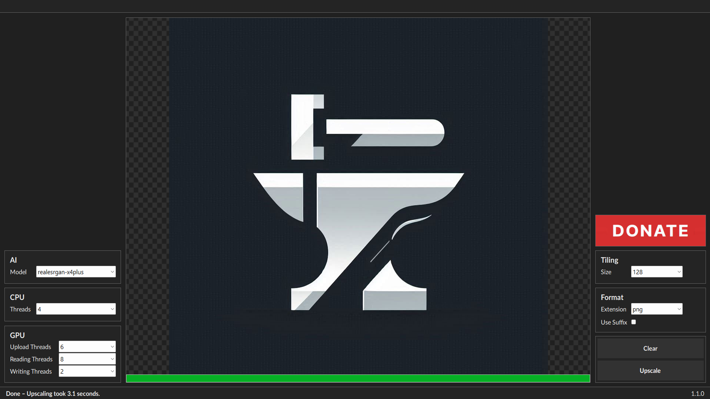

# Sharp Forge

Sharp Forge is a powerful image upscaling and enhancement tool utilizing **Real-ESRGAN** to deliver high-quality results. Designed for ease of use and efficiency, it enhances image clarity, resolution, and details through advanced AI-powered processing.

## Features

- **AI-powered upscaling** with **Real-ESRGAN**.
- **User-friendly interface** for a seamless workflow.
- **Support for multiple formats** (input and output).
- **Optimized performance** for fast and efficient processing.

## Installation

1. **Download** and extract the latest version of Sharp Forge.
2. **Run** the executable file to launch the program.
3. **Load** your image and select the desired upscaling settings.
4. Click **Process** to enhance your image.
5. **Save** your upscaled image in your preferred format.

## Dependencies

Sharp Forge relies on the following technologies:

- **Real-ESRGAN** for AI-based upscaling ([GitHub Repository](https://github.com/xinntao/Real-ESRGAN)).

## Acknowledgments

Sharp Forge includes icons from:

- [Brazil icons](https://www.flaticon.com/free-icons/brazil) by **High Quality Icons** - Flaticon
- [United States icons](https://www.flaticon.com/free-icons/united-states) by **Freepik** - Flaticon
- [Flags icons](https://www.flaticon.com/free-icons/flags) by **Marcus Christensen** - Flaticon

Additionally, Sharp Forge is inspired by **Cupscale**, a similar upscaling tool. Check out [Cupscale here](https://github.com/n00mkrad/cupscale).

## License

Sharp Forge is **free to use** but remains **closed-source** and the property of its creator. Donations are welcome to support its development.

This software is provided **as is**, with no guarantees regarding performance, security, or reliability. The creator is not responsible for any issues, damages, or losses resulting from its use.

## Disclaimer

Users must ensure they have the legal rights to process and use images commercially. Sharp Forge does not grant permission for copyrighted images; it only enhances them. Users are responsible for complying with all copyright and licensing laws.
